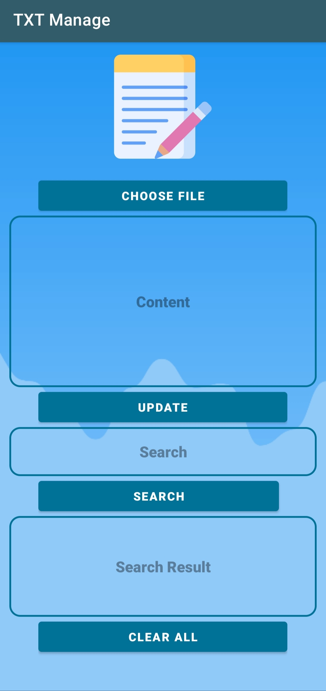
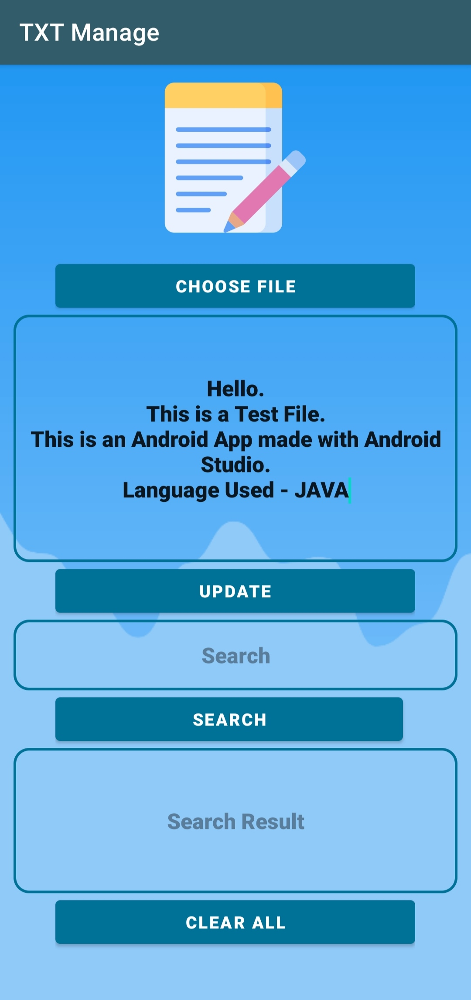
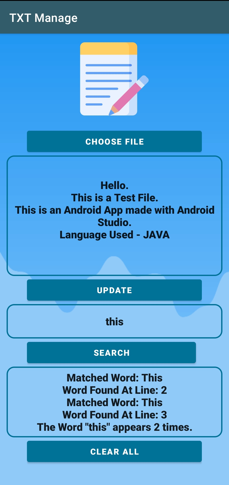

# Text File Manager (Android)
## Overview
* This is a Text File managing android app made with Android Studio.
* The project is written in JAVA language.
* This app allows you to select a text file and perform various tasks.

## Users can perform the following functions
1. Select a text file from file manager.
2. Edit the file.
3. Search for a particular word/string.

## Requirements
* [Android Studio](https://developer.android.com/studio)

## Installation
* Close the Repository.
* Open Android Studio.
* Import the project.

## Screenshots
### Main

### Open File

### Search

